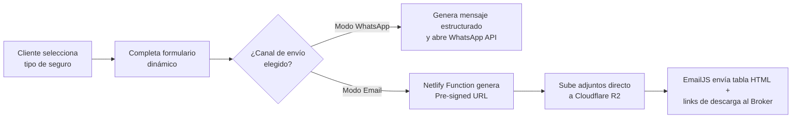

<div align="center">

# 🛡️ PaginaSeguros

### Landing Page & Sistema de Cotización Multiriesgo para Productores Asesores de Seguros (PAS) y Brokers

[](https://developer.mozilla.org/es/docs/Web/HTML)
[](https://developer.mozilla.org/es/docs/Web/CSS)
[](https://developer.mozilla.org/es/docs/Web/JavaScript)
[](https://www.netlify.com)
[](https://www.cloudflare.com/developer-platform/r2/)
[](https://www.emailjs.com)
[]()

</div>

---

## 📋 Descripción del proyecto

**PaginaSeguros** es una solución web integral de alta conversión diseñada específicamente para **Productores Asesores de Seguros (PAS)** y Brokers. Más que una landing page informativa, funciona como un sistema completo de captación y gestión inicial de leads (cotizaciones) con enrutamiento dinámico, carga de archivos adjuntos bajo arquitectura serverless y una interfaz centrada en la experiencia de usuario (UX).

El proyecto está construido bajo una arquitectura **JAMstack**, priorizando tiempos de carga instantáneos y eliminando el costo de mantenimiento de servidores tradicionales sin sacrificar funcionalidades avanzadas de backend.

## 🎯 El problema que resuelve

En la operatoria diaria de un productor o broker de seguros, la captación de clientes suele dispersarse en consultas incompletas por redes sociales o mensajes sin los datos ni la documentación necesaria para cotizar (fotos del vehículo, cédula verde, póliza actual), generando idas y vueltas que enfrían la venta.

**PaginaSeguros** estandariza y automatiza la entrada de consultas dándole al cliente **un flujo guiado según el riesgo que desea asegurar**, recolectando exactamente los datos técnicos y archivos adjuntos requeridos antes de entregar el lead listo para cotizar en el WhatsApp o correo electrónico del asesor.

## ✨ Características principales

### 📝 Módulo de Cotización Dinámica Multiriesgo
- Formularios en ventanas modales que adaptan estrictamente sus campos y validaciones según el ramo seleccionado (**Autos, Motos, Hogar, Caución, Vida, ART, Mala Praxis**, entre otros).
- Validación de campos en tiempo real del lado del cliente para garantizar solicitudes completas.

### 🔀 Módulo de Enrutamiento Dual de Leads
- **Modo WhatsApp:** Genera un mensaje de texto pre-estructurado con todos los datos ingresados y redirige al usuario a la API de WhatsApp, indicándole de forma clara qué documentación adicional debe adjuntar en el chat.
- **Modo Email Automático:** Procesa la solicitud y la envía directamente a la bandeja de entrada del Broker utilizando una plantilla HTML corporativa mediante **EmailJS**, incluyendo tablas estructuradas y enlaces de descarga directa.

### ☁️ Módulo de Almacenamiento Serverless de Archivos
- Integración nativa con **Cloudflare R2** (compatible con S3) a través de **Netlify Functions**.
- Subida directa desde el navegador del cliente (fotos de vehículos, cédulas verdes, facturas o pólizas) mediante URLs pre-firmadas (*Pre-signed URLs*), sin saturar servidores tradicionales.
- Generación e inserción automática de las URLs de descarga dentro del correo enviado al broker.

### 🤖 Asistente Virtual UI (Chatbot)
- Menú flotante interactivo diseñado para brindar soporte inmediato las 24 horas.
- Derivación guiada de siniestros con plantillas pre-armadas.
- Directorio rápido de contactos de urgencia, grúas y asistencias mecánicas de múltiples compañías aseguradoras.

## 🏗️ Arquitectura y stack tecnológico

El sistema implementa una arquitectura **JAMstack** desacoplada, optimizada para velocidad, seguridad y escalabilidad:

| Capa | Tecnología | Uso |
|---|---|---|
| Frontend | **HTML5** + **CSS3** | Maquetación semántica y diseño responsivo puro (CSS Variables, Flexbox y Grid) |
| Lógica de cliente | **Vanilla JavaScript (ES6+)** | Control de modales dinámicos, validaciones, chatbot y orquestación de APIs |
| Backend / Serverless | **Netlify Functions (Node.js)** | Generación segura de *Pre-signed URLs* para autorizar subidas de archivos |
| Almacenamiento | **Cloudflare R2** | Persistencia de objetos en la nube (compatible con API AWS S3) para adjuntos |
| Servicio de correo | **EmailJS Client SDK** | Envío transaccional de cotizaciones con plantillas HTML corporativas |
| Control de versiones | **Git** + **GitHub** | Gestión de código fuente y despliegue continuo (CI/CD) con Netlify |

### Decisiones de diseño destacadas

- **Cero frameworks pesados en el Frontend:** Uso de HTML5, CSS3 y JavaScript nativo para lograr una puntuación óptima de rendimiento y carga instantánea en dispositivos móviles con conexiones lentas.
- **Subida directa mediante Pre-signed URLs:** Las credenciales de Cloudflare R2 nunca se exponen en el frontend; la Netlify Function firma una URL temporal y el navegador sube el archivo directamente al bucket.
- **Formularios polimórficos en un único flujo:** En lugar de crear múltiples páginas por cada tipo de seguro, el motor en JavaScript reconfigura el DOM del modal dinámicamente según el riesgo elegido.
- **Diseño 100% Responsive:** Uso de variables CSS centralizadas que facilitan la personalización de colores e identidad de marca para cualquier agencia o productor.

## 📁 Estructura del proyecto

```text
PaginaSeguros/
├── assets/
│   ├── css/
│   │   └── styles.css          # Estilos globales, variables CSS y diseño responsive
│   ├── img/                    # Logos de compañías aseguradoras y recursos gráficos
│   └── js/
│       └── app.js              # Lógica de UI, modales dinámicos, Cloudflare R2 y EmailJS
├── netlify/
│   └── functions/
│       └── get-upload-url.js   # Endpoint Serverless (Node.js) para firma de URLs S3/R2
├── index.html                  # Landing page principal y estructura de componentes
└── README.md                   # Documentación técnica del proyecto
```
🚀 Instalación y puesta en marcha
Requisitos previos
Cuenta en Netlify (o Netlify CLI para entorno local)

Bucket configurado en Cloudflare R2

Cuenta activa en EmailJS

Node.js 18 o superior (para ejecución de funciones serverless)

Pasos
Bash
# 1. Clonar el repositorio
git clone [https://github.com/Scomes02/PaginaSeguros.git](https://github.com/Scomes02/PaginaSeguros.git)
cd PaginaSeguros

# 2. Instalar dependencias (si se ejecuta con Netlify CLI localmente)
npm install
Configurá las variables de entorno para el almacenamiento serverless en el panel de Netlify (Site configuration > Environment variables) o en tu archivo .env local:

Fragmento de código
R2_ACCOUNT_ID=tu_id_de_cuenta_cloudflare
R2_ACCESS_KEY_ID=tu_access_key_id_de_r2
R2_SECRET_ACCESS_KEY=tu_secret_access_key_de_r2
R2_BUCKET_NAME=nombre_de_tu_bucket
R2_CUSTOM_DOMAIN=[https://archivos.tudominio.com](https://archivos.tudominio.com) # Opcional: dominio público para R2
En el archivo assets/js/app.js, localizá la sección de configuración de APIs y reemplazá las constantes con las credenciales de tu cuenta de EmailJS:

JavaScript
const EMAILJS_PUBLIC_KEY = "TU_PUBLIC_KEY";
const EMAILJS_SERVICE_ID = "TU_SERVICE_ID";
const EMAILJS_TEMPLATE_ID = "TU_TEMPLATE_ID";
Nota sobre EmailJS: Asegurate de crear un template en tu cuenta de EmailJS que soporte inyección de variables HTML con triple llave ({{{resumen_datos_html}}}) para renderizar correctamente la tabla estructurada con los datos del cliente y los enlaces de los archivos adjuntos.

Bash
# 3. Levantar el entorno de desarrollo local con Netlify CLI
netlify dev
Para pasar a producción, conectá el repositorio de GitHub a Netlify: el sistema desplegará automáticamente la carpeta raíz y habilitará el endpoint serverless ubicado en netlify/functions/get-upload-url.js.

### 🧩 Flujo del sistema


### 👤 Autor
**Santiago Comes** 
- 💻 GitHub: [Scomes02](https://github.com/Scomes02)
- 💼 LinkedIn: [Santiago Comes](https://www.linkedin.com/in/santiago-comes)
- 📄 Fiverr: [Santiago Comes](https://es.fiverr.com/users/santi_comes/seller_dashboard)

📄 Licencia
Plantilla y sistema desarrollados para uso comercial de Productores Asesores de Seguros (PAS) y Brokers. Si deseás implementar esta solución para tu propia agencia o necesitás un desarrollo a medida, podés contactarme a través de mis canales profesionales.
